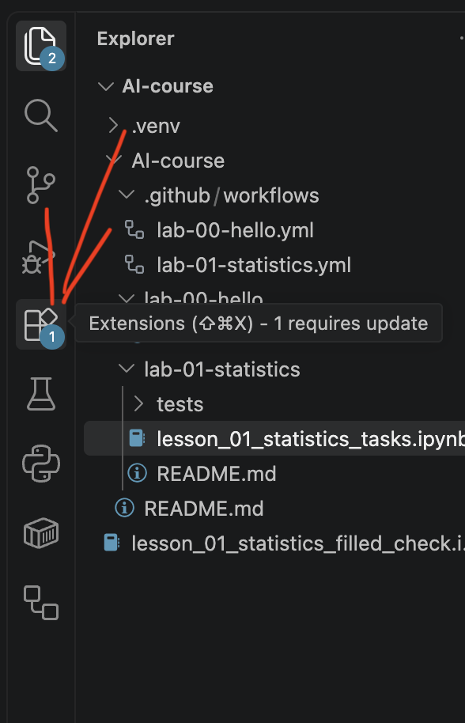
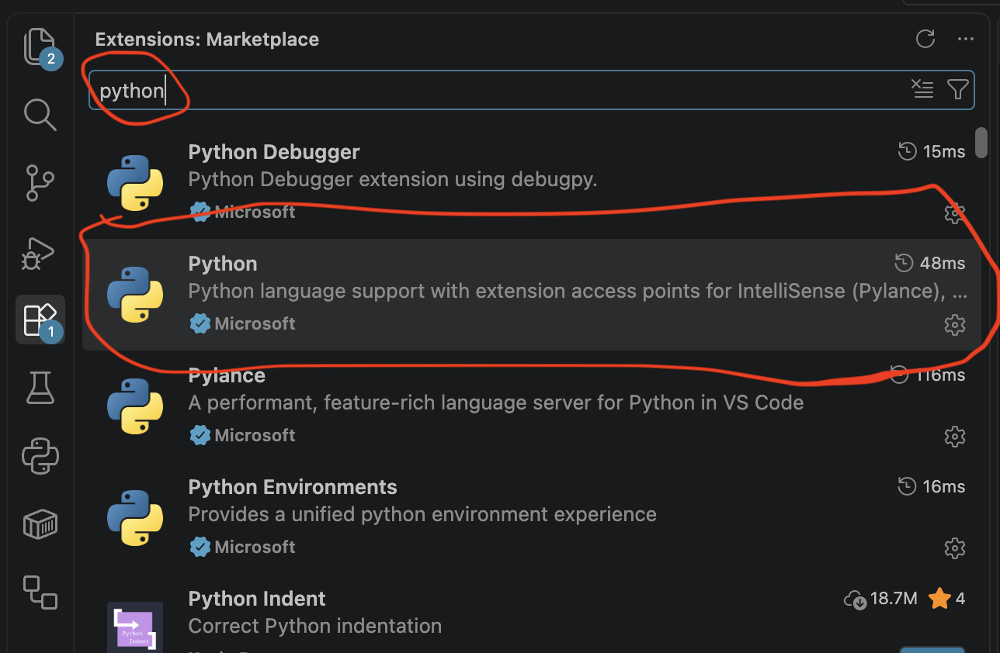
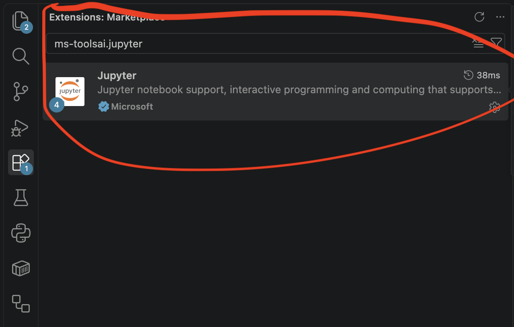
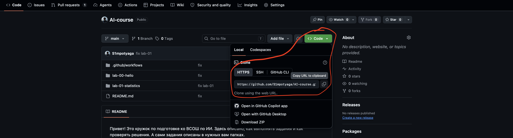
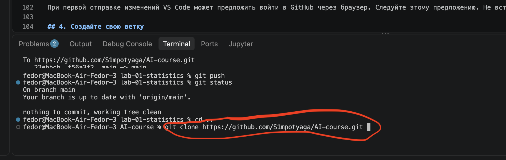
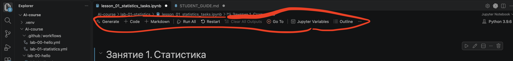
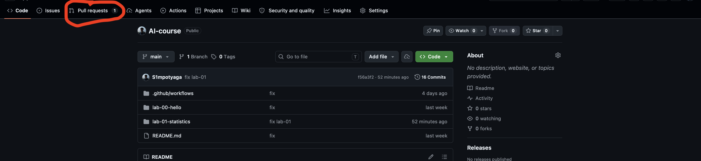
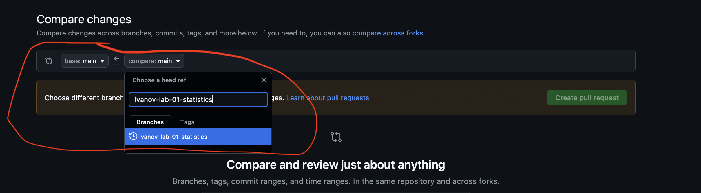
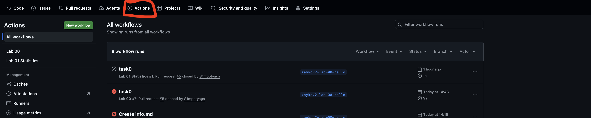
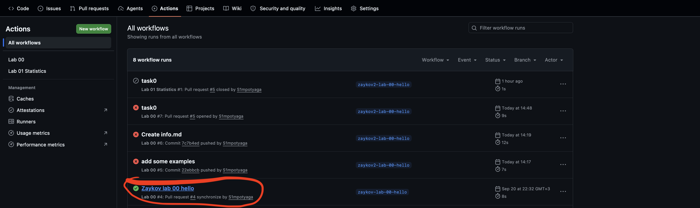

Привет! Это репозиторий, где будут лежать все задания по подготовке к олимпиадам школьников по ИИ.


# Работа с учебным репозиторием: Python, VS Code и Jupyter


| Что нужно знать | Значение |
| --- | --- |
| Репозиторий | https://github.com/S1mpotyaga/AI-course.git |
| Основная ветка репозитория | `main` |
| Папка лабораторной каждой лабораторной | `lab-<number>-<name of lab>` |
| Имя ветки, которую нужно отправлять | `<surnmae>-lab-<number>-<name of lab>` |
| Пример имени ветки ученика | `ivanov-lab-01-statistics` |

## 1. Что мы будем делать

Один раз установим инструменты, скопируем репозиторий на компьютер и настроим Python. Для каждой лабораторной будем создавать отдельную ветку, решать задания, проверять их и отправлять Pull Request.

| Слово | Что оно означает |
| --- | --- |
| Git | Программа, которая сохраняет историю изменений файлов |
| GitHub | Сайт, где хранится репозиторий и обсуждаются изменения |
| Репозиторий | Файлы проекта вместе с историей их изменений |
| Clone | Скачивание репозитория вместе с историей на компьютер |
| Ветка, branch | Отдельная линия работы над изменениями |
| Commit | Сохранённый в Git набор изменений с пояснением |
| Push | Отправка коммитов с компьютера на GitHub |
| Pull Request, PR | Предложение добавить изменения из своей ветки в основную |
| VS Code | Редактор, в котором мы будем работать |
| Ноутбук, `.ipynb` | Документ с текстом, кодом и результатами выполнения |
| CI / GitHub Actions | Автоматическая проверка кода на сервере GitHub |

**Сохранить файл, сделать commit и выполнить push — три разных действия.** Сохранение обновляет файл на компьютере. Commit добавляет изменения в локальную историю. Push отправляет эту историю на GitHub.

## 2. Установите инструменты

### 2.1. Учётная запись GitHub

Откройте [github.com](https://github.com/) и войдите в свой аккаунт. Если аккаунта нет, зарегистрируйтесь с учётом правил сервиса. Запомните свой логин: он понадобится при работе с репозиторием.

### 2.2. Git

Скачайте Git с [официального сайта](https://git-scm.com/downloads).

- **Windows:** установите Git for Windows. В обычном случае подходят предложенные установщиком настройки, включая доступ к Git из командной строки.
- **macOS:** выполните `git --version` в Terminal. Если система предложит установить инструменты разработчика, завершите установку. Если Git уже работает, повторная установка не нужна.
- **Linux:** установите Git через менеджер пакетов своего дистрибутива. На школьном компьютере при отсутствии прав обратитесь к преподавателю.

Проверка в терминале:

```bash
git --version
```

Ожидаемый результат — строка вида `git version ...`. После установки может понадобиться закрыть и снова открыть терминал или VS Code.

### 2.3. VS Code

Скачайте **Visual Studio Code** с [code.visualstudio.com](https://code.visualstudio.com/). Это отдельный продукт; Visual Studio для этой работы не требуется.

Откройте VS Code и панель **Extensions / Расширения**. 



Найдите и установите расширения от **Microsoft**:

| Расширение | Идентификатор | Для чего нужно |
| --- | --- | --- |
| Python | `ms-python.python` | Работа с Python и выбор интерпретатора |
| Jupyter | `ms-toolsai.jupyter` | Открытие и выполнение ноутбуков `.ipynb` |





## 2. Получите репозиторий на компьютер

1. Примите приглашение.
2. Откройте репозиторий, ссылка на который есть в начале этой инструкции в таблице.
3. Нажмите **Code → HTTPS** и скопируйте URL.



### Клонируем репозиторий к себе на компьютер

Сделаем это через терминал в vs code. Чтобы открыть терминал в левом верхнем углу найдите вкладку **View** -> **Terminal**. Там в своей директории для кружка напишите вот эту команду: 

```bash
git clone https://github.com/S1mpotyaga/AI-course.git 
```



После выполнения откройте созданную папку через **File → Open Folder**. Не запускайте повторный `git clone`, находясь внутри уже скачанного репозитория.


### Представьтесь Git

В VS Code откройте **Terminal → New Terminal** и выполните:

```bash
git config user.name "ВАШЕ ИМЯ И ФАМИЛИЯ"
git config user.email "ВАШ_EMAIL_ДЛЯ_КОММИТОВ"
```
EMAIL используйте тот, который вы использовали при регестрации на гитхабе.

При первой отправке изменений VS Code может предложить войти в GitHub через браузер. Следуйте этому предложению. Не вставляйте пароль или токен в ноутбук.

## 3. Создайте свою ветку

Все следующие Git-команды выполняйте в терминале, открытом в корне репозитория.

Проверьте состояние измененных файлов:

```bash
git status
```

Перейдите в основную ветку и получите обновления:

```bash
git checkout main
git pull origin main
```

Создайте ветку задания. Она должна называться в формате **<surname>-lab-<number of lab>-<name of lab>**

```bash
git checkout -b ivanov-lab-01-statistics
```

То есть сначала фамилия, далее слово `lab`, затем номер задания и название задания.

**Для текущего CI (автоматический запуск тестов на гитхабе) имя ветки обязательно должно содержать `-lab-01-` и не должно содержать `/`.**

| Имя | Подходит под фильтр CI? |
| --- | --- |
| `ivanov-lab-01-statistics` | Да |
| `petrova-lab-01-solution` | Да |
| `lab-01-statistics` | Нет: отсутствует дефис перед `lab` |
| `ivanov/lab-01-statistics` | Нет: присутствует `/` |
| `ivanov-lab-1-statistics` | Нет: требуется `01` |

Если ветка уже создана, переключайтесь на неё без флага `-b`:

```bash
git checkout ivanov-lab-01-statistics
```

Проверка:

```bash
git branch
```

Зеленым будет подсвечиваться текущая ветка, в которой авы находитесь.

## 4. Выполняйте задания и запускайте проверки

### Как устроена ячейка

**Markdown-ячейка** содержит условия, формулы и письменные ответы. Двойной щелчок открывает редактирование. **Кодовая ячейка** содержит Python и выполняется специальным ядром для выполнения ячеек в ноутбуке.

| Действие | Как выполнить |
| --- | --- |
| Выполнить ячейку и перейти дальше | `Shift+Enter` или слева от ячейке есть треугольник (кнопка запуска)|
| Выполнить ячейку, оставшись на ней | `Ctrl+Enter` |
| Сохранить ноутбук | `Ctrl+S` / `Cmd+S` |
| Прервать долгое выполнение | Кнопка остановки / Interrupt |
| Начать с чистой памяти Python | Restart Kernel |
| Выполнить все ячейки | Run All |

Можно сразу перезапустить все ячейки (Run All), перезапустить ноутбук или сбросить все найстроки (Restart), добавить в конец ячейку с кодом или текстовую ячейку (+ Code/ + Markdown):



### Порядок работы с заданием

1. Прочитайте условие, ограничения и формат результата.
2. Если предусмотрен ручной расчёт, заполните соответствующий список ответов.
3. Найдите заготовку функции.
4. Реализуйте её, сохранив имя функции и параметры.
5. Уберите заменённый `raise NotImplementedError` и относящийся к законченной функции `# TODO`.
6. Выполните ячейку с определением функции.
7. Выполните следующую ячейку проверки.
8. Прочитайте сообщения теста. Если есть ошибка, исправьте код и повторите шаги 6–7.
9. Заполните письменное объяснение, если оно требуется.

**Редактирование кода не обновляет функцию в памяти.** После изменения определения функцию нужно выполнить заново, иначе тест проверит старую версию.

`None` в списке ручных ответов обычно означает, что ответ ещё не заполнен. Но по условию функции асимметрии `None` — правильный результат для постоянного непустого набора. Ориентируйтесь на конкретное условие.

### Правила для заданий

- Не меняйте имена функций, параметры, имя ноутбука и расположение папки `tests`.
- Сохраняйте своё решение в ноутбуке (в файле с расширением .ipynb). Никаких других файлов, кроме вводного задания, не должно быть.
- Не меняйте тесты ради зелёного результата. Будет еще ручная проверка. Если замечу, что поменяли тесты - выгоню с кружка.
- Не заменяйте собственные вычисления готовыми статистическими функциями, если это запрещено условием.
- Не добавляйте личные абсолютные пути и запросы интерактивного ввода `input()` в ячейки с определениями проверяемых функций.
- Перед сдачей перезапустите ядро, запустите ноутбук сверху вниз, прочитайте результаты и сохраните файл.

### Как читать ошибку

Начните с последней строки вывода: там обычно указаны тип ошибки и пояснение. Затем найдите строку вашего кода, на которую указывает traceback.

- `AssertionError` — результат не совпал с ожидаемым либо нарушено проверяемое условие.
- `NotImplementedError` — осталась заготовка реализации.
- `NameError` — имя неизвестно: например, не выполнена ячейка с функцией или импортом.
- `TypeError` — операция получила неподходящее значение, например `None` вместо числа.
- `SyntaxError` / `IndentationError` — проверьте скобки, двоеточия и отступы.

Отсутствие красного traceback само по себе не означает успех: скрипт может перехватывать ошибку и печатать «ЕЩЁ НЕ ГОТОВО». Читайте сообщения, а не только цвет значка.

## 5. Сохраните решение и отправьте его на GitHub

Сначала сохраните ноутбук в VS Code. Затем в терминале из корня репозитория выполните:

```bash
git status
git branch
```

Убедитесь, что вы в своей ветке и изменён нужный ноутбук. Добавьте именно этот файл:

Например:

```bash
git add lab-01-statistics/lesson_01_statistics_tasks.ipynb
git commit -m "Complete lab 01 statistics"
git push -u origin ivanov-lab-01-statistics
```

В последней команде используйте **своё** имя ветки. 

Не используйте `git add .` без проверки списка изменений.

Если commit сообщает `nothing to commit`, проверьте, сохранён ли файл и были ли изменения. Не нужно создавать пустой коммит.

## 6. Создайте Pull Request и проверьте результат

### Открытие PR

1. Откройте GitHub после успешного push.
2. Откройте **Pull requests → New pull request**.



3. Проверьте направление изменений:

| Поле | Что выбрать |
| --- | --- |
| Base repository | Репозиторий преподавателя |
| Base branch | `main` |
| Compare / head branch | Ваша ветка, например `ivanov-lab-01-statistics` |



4. Используйте название вашего PR как `ivanov-lab-01`, чтобы было видно кто сделал этот PR и какое задание.

### Когда срабатывает текущая автоматическая проверка

После создания PR откройте **Actions** в репозитории → **ivanov-lab-01**. Смотрите свои PR. Посмотрите итог и полный текст ошибок.





### Исправления после замечаний

**Пока PR открыт:** исправьте файл в той же ветке, сохраните, проверьте, сделайте новый commit и `git push`. Изменения появятся в существующем PR; новый PR создавать не нужно.

## 7. Получайте обновления перед следующей работой

Сначала завершите текущую работу: сохраните её, сделайте commit и при необходимости push. Команда `git status` должна показывать чистое состояние.

### Для получения новой работы сделайте следующее

```bash
git switch main
git pull 
```

После этого создавайте новую ветку от обновлённого `main` по правилам новой лабораторной.

**Не клонируйте репозиторий заново ради каждого обновления.** Обычно достаточно синхронизации и `git pull`.

Если нужна помощь, отправьте в ОБЩИЙ ЧАТ:

1. Название лабораторной и ссылку на PR, если он есть.
2. Команду или ячейку, которую выполняли.
3. Полный текст ошибки, а не только последнюю строку или обрезанный скриншот.

## 8. Чек-лист перед сдачей

- [ ] Работа сделана в своей ветке; для лабораторной № 1 имя содержит `-lab-01-` и не содержит `/`.
- [ ] Файл сохранён под точным именем `lab-01-statistics/lesson_01_statistics_tasks.ipynb`.
- [ ] Все нужные функции реализованы, имена и параметры сохранены.
- [ ] Удалены заменённые заглушки и отметки `TODO` в законченных функциях.
- [ ] Заполнены ручные и письменные ответы.
- [ ] Ноутбук перезапущен; ноутбук выполнен сверху вниз; результаты прочитаны и сохранены.
- [ ] Нет пропущенных проверок и сообщений «ЕЩЁ НЕ ГОТОВО» для обязательной части.
- [ ] В решении нет личных абсолютных путей.
- [ ] Выполнен push; на GitHub видна последняя версия.
- [ ] PR направлен в нужный репозиторий и ветку `main`.

## 9. Короткая памятка на каждое занятие

1. Откройте существующую папку репозитория в VS Code.
2. Проверьте `git status` и текущую ветку.
3. Для продолжения работы переключитесь на свою ветку. Для новой лабораторной сначала обновите `main`, затем создайте новую ветку.
4. Проверьте рабочую папку и запускайте ячейки по порядку.
6. Решайте, проверяйте, сохраняйте.
7. Перед отправкой перезапустите ядро и повторите проверки.
8. Выполните `git add` нужного файла, `git commit`, `git push`.
9. Создайте или обновите PR.


## Дополнительные материалы про Git

- [Что такое Git и для чего он нужен](https://practicum.yandex.ru/blog/chto-takoe-git-i-dlya-chego-nuzhen/) — простая вводная статья.
- [Подробнее о Git](https://habr.com/ru/articles/313890/) — подробная статья с большим количеством иллюстраций.